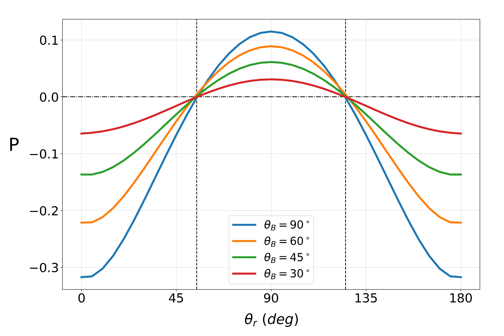
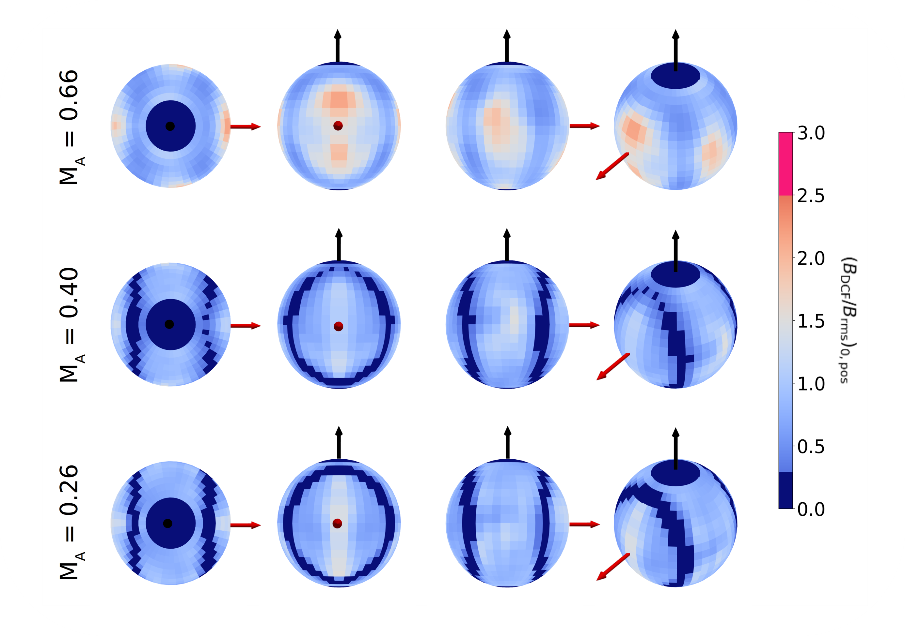

Magnetic fields play a crucial role in the dynamics of astrophysical plasmas by influencing their dynamics. Measuring their strength accurately remains a challenge due to limitations in conventional methods such as the Davis–Chandrasekhar–Fermi (DCF) approach, which traditionally relies on dust polarization and line-of-sight velocity 

<figure style="float: left; margin-right: 30px; margin-top: 5px; margin-bottom: 10px; max-width: 450px;">
  
  <figcaption>Fig 1. The degree of polarization from the GSA effect for different orientations of background B-field ($\theta_B$) and incident radiation ($\theta_r$) with respect to the line-of-sight. Positive and negative polarization fractions indicate parallel and perpendicular alignment to the magnetic field.</figcaption>
</figure>

dispersion measurements from separate sources. In this work, we propose a modified DCF method that incorporates polarization from atomic alignment, specifically using the Ground-State Alignment (GSA) effect in spectral lines. By performing 3D magnetohydrodynamic (MHD) turbulence simulations, we generate synthetic spectropolarimetric observations and apply the modified DCF method, which includes a correction factor to account for the turbulence driving scale. 

<figure style="float: right; margin-left: 30px; margin-top: 5px; margin-bottom: 10px; max-width: 450px;">
  
  <figcaption>Fig 2. The distribution of normalized plane-of-sky mean B-field strength measured using the modified DCF from GSA for B-field 3D orientation.</figcaption>
</figure>

Our results show that this technique provides robust estimates of the plane-of-sky magnetic field strength, particularly for sub-Alfvénic turbulence, with a newly proposed correction factor for the modified DCF method. The method remains valid across various magnetic field orientations but encounters a minimum B-field inclination threshold of for reliable measurements. Compared to dust polarization, atomic alignment polarization mitigates uncertainties related to dust grain size, composition and alignment efficiency while ensuring that both velocity and polarization measurements originate from the same source. Our findings suggest that this approach can improve the accuracy of magnetic field measurements in astrophysical environments and potentially enable 3D magnetic field tomography.