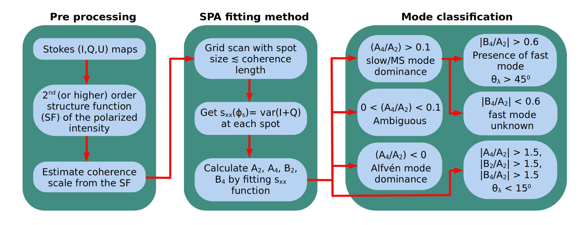

Magnetohydrodynamic (MHD) turbulence is a fundamental process shaping the interstellar medium (ISM), governing cosmic-ray transport, star formation, and other processes of astrophysical plasmas. A key challenge in studying MHD turbulence is the separation of turbulent components in the fundamental MHD linear modes, Alfvén, slow, and fast modes, using observational data. Synchrotron polarization statistics
<figure style="float: left; margin-right: 30px; margin-top: 5px; margin-bottom: 10px; max-width: 300px;">
  
  <figcaption>Fig 1. Polarization vectors from synthetic synchrotron observations superimposed on the density distribution from a 2D slice of a 3D ideal MHD simulation.
</figcaption>
</figure>

provide a promising avenue for mode classification, with previous studies suggesting that variations in the Stokes parameters can reveal the dominant MHD mode. This work presents a numerical study of the synchrotron polarization analysis (SPA) method, systematically investigating the statistical behavior of the Stokes parameters in the context of MHD turbulence. By deriving theoretical relationships from turbulence statistics, we refine the SPA method, incorporating a new SPA+ fitting procedure that enables reliable mode classification. Using 3D ideal MHD simulations spanning a broad range of plasma parameters and turbulence driving mechanisms, we generate synthetic synchrotron observations and test the modified method’s ability to distinguish between Alfvénic and compressible turbulence.

A key result is the development of a classification criterion that quantifies the dominance of Alfvén versus slow modes based on the shape of the Stokes parameter variance function. Furthermore, we introduce an asymmetry parameter that allows, for the first time, the identification of fast mode turbulence using polarization statistics. This is particularly significant for cosmic-ray transport studies, as fast modes play a crucial role in particle acceleration and scattering. 

<!-- <figure style="float: right; margin-left: 30px; margin-top: 5px; margin-bottom: 10px; max-width: 600px;">
  
  <figcaption>Fig 2. A flowchart showing the complete SPA+ classification scheme.</figcaption>
</figure> -->

<figure style="max-width: 1200px;">
  
  <figcaption>Fig 2. A flowchart showing the complete SPA+ classification scheme.</figcaption>
</figure>

Importantly, we confirm that the method remains robust even in the presence of Faraday rotation, a common source of uncertainty in synchrotron-based analyses. By enabling the quantitative decomposition of MHD turbulence into its constituent modes, this work provides a new diagnostic tool for probing the magnetic and dynamical state of the ISM, improving our ability to interpret astrophysical polarization data.

